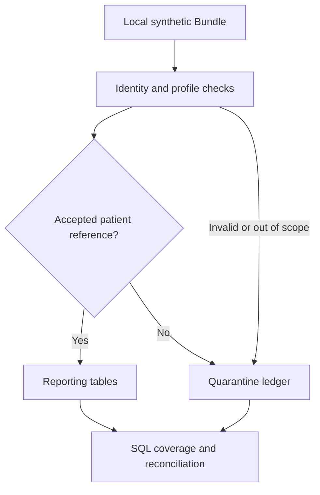

# FHIR to reporting tables: data quality first

[Open the case study](https://devaharshagubbala07-hub.github.io/projects/fhir-quality/) · [Findings](outputs/findings.md) · [Reporting SQL](sql/coverage.sql)

**Question:** Which incoming resources can be used in a reporting table, and what happens to the denominator when records fail validation?

The new offline demo processes **33 intentionally flawed fictional entries**, loads 23, quarantines 10 and retains one missing-birth-date warning. It reports **6 of 8 loaded patients** with an accepted observation whose status is exactly `final`. Ten final observation rows belong to those six patients: counting rows as people would overstate coverage.

## Original project and new extension

The original graduate team presentation, *FHIR Works: Connecting Healthcare with Data Standards*, documents Python API extraction, access-token handling, terminology lookups, and posting Patient, Condition, Observation and Procedure resources to a target FHIR server. Team members: Vaishnavi Medasani, Sai Pallavi Bramhanapalli, Nigama Pervala, Yugala Ramula and Devaharsha Gubbala. The slides do not identify individual task ownership.

The runnable code here is a **new September 2026 portfolio extension developed with AI assistance**. It applies the original ETL theme to an analyst's problem: reliable reporting tables and visible data-quality decisions. It does not reproduce the original private university code, connect to its servers, or claim production outcomes. The supplied annotated presentation remains the source for the academic narrative; it is not redistributed. [Provenance](provenance.json).

## Run

Python 3.11+; standard library only. No credentials, server or installation required.

```bash
cd projects/fhir-quality
python pipeline.py
python -m unittest -v
```

`data/demo-bundle.json` is included. To recreate it exactly, run `python make_fixture.py` first. The pipeline creates an in-memory SQLite database, applies the SQL reporting query and writes `outputs/summary.json` and `outputs/findings.md`. It does not persist a database or upload data.

## Flow and data model



Patient records are validated first; dependent resource references resolve only to accepted patients. Tables are loaded in parent-first order even when input entries arrive in another order. `patient.patient_id` is the foreign key target for observations and condition records. The audit ledger retains every input entry and its disposition.

## Rules that matter

| Situation | Decision | Why |
| --- | --- | --- |
| Same resource type and ID appears twice | Quarantine every copy | Input order cannot choose an authoritative record |
| Reused full URL | Quarantine ambiguous entries | References need an unambiguous identity |
| Relative Patient reference | Match exact accepted type/ID | Preserve referential integrity |
| Absolute or URN reference | Match exact accepted `fullUrl` | Do not strip a foreign server's namespace |
| Missing optional birth date | Load with warning; retain null | Missing demographics should not be invented |
| Partial birth date | Preserve YYYY or YYYY-MM | Do not fabricate day/month precision |
| Unexpected measurement unit | Quarantine for review | The demo profile requires UCUM `/min` |
| Preliminary observation | Load, exclude from final-only report | Data validity and report inclusion are separate decisions |
| Valid FHIR resource outside this demo profile | Quarantine as out of scope | A scoped analytic profile is not the whole FHIR standard |

## Deliberately limited reporting profile

FHIR R4-shaped `collection` Bundle only. Patient, scalar heart-rate Observation (LOINC `8867-4`, UCUM `/min`, timestamp with timezone), and single-coding Condition records are supported. Conditions use a clearly fictional code system. Codes and namespaces are preserved; the demo performs **no SNOMED hierarchy substitution**. A code's presence is not terminology validation.

Full FHIR validation, implementation-guide conformance, search pagination, authentication, API writes, terminology services, multiple codings, observation components, clinical plausibility and clinical interpretation are outside this demo. An omitted field can be legal in base FHIR while required by this reporting profile. No care gap or treatment conclusion follows from the coverage metric. FHIR formatting alone does not establish privacy compliance.

Birth-date plausibility uses a fixed fixture reference date of January 31, 2026. The original deck's referral/BPMN claims are not carried into this case study because that workflow is not evidenced in the supplied FHIR presentation.

## Validation

Nine tests cover known fixture totals, order independence, duplicate identities, exact reference namespaces, dependent invalidation, missing/partial dates, an empty denominator, non-mutation and malformed coding. Five source-to-output checks cover entry totals, resource totals, patient denominators, foreign keys and null preservation. Issue counts may exceed quarantined rows because one entry can fail multiple rules.

## Standards references

- [HL7 FHIR R4 Bundle](https://hl7.org/fhir/R4/bundle.html)
- [R4 resource references](https://hl7.org/fhir/R4/references.html)
- [Patient](https://hl7.org/fhir/R4/patient.html), [Condition](https://hl7.org/fhir/R4/condition.html), [Observation](https://hl7.org/fhir/R4/observation.html)
- [Vital-sign observation profiles](https://hl7.org/fhir/R4/observation-vitalsigns.html)

These links document the standard. The demo's narrower acceptance rules are project choices, not a complete statement of FHIR requirements.
